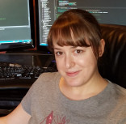

	<h1>Staff</h1>
	

		

			
			

				<strong>Rosana Mesa, Ph.D.</strong> 
				Senior Research Technician 
				Jill of All Lab Trades
			

		

	

	

	
	 
	<h1>Past rotation students</h1>
	
	

		

			
			

				<strong>Thomas Marsh</strong> 
				HSG program 
				Now: Cruchaga lab
			

		

	

	
	

	
	 
	<h1>Past med school EXPLORE immersions</h1>
	
	

		

			
			

				<strong>Derek Platt, Ph.D.</strong> 
				MSTP program
			

		

	

	
	

	
	<!--
	 
	<h1>Trainees</h1>
	-->

	<!--
	 
	<h1 class="center">Bio&#91;informatics&#124;statistics&#93; Masters Trainees</h1>
	-->

	<h1>Lab alumni</h1>
	

		

			
			

				<strong>Charissa Martin, M.S.</strong> 
				Then: Bioinformatics Analyst 
				Now: Bioinformatics Research Assistant - WUSTL Ibanez lab
			

		

	

	

		

			
			

				<strong>David Morales-Heil, Ph.D.</strong> 
				Then: Postdoc 
				Now: Pfizer
			

		

	

	

		

			
			

				<strong>Rachel Rodgers, M.S.</strong> 
				Then: Bioinformatics Assistant 
				Now: <a href="https://baldridgelab.wustl.edu/">Baldridge</a> & <a href="http://research.peds.wustl.edu/labs/holtz_l/">Holtz</a> labs
			

		

	

	

		

			
			

				<strong>Nicole Fergestrom, M.S.</strong> 
				Then: Research Assistant 
				Now: Biostatistician at CorEvitas
			

		

	

	

		

			
			

				<strong>Tyler Day, M.S.</strong> 
				Then: Research Intern 
				Now: Lab Manager - UW, Seattle
			

		

	

	

		

			
			

				<strong>Li Cao, M.D.</strong> 
				Then: Staff Scientist 
				Now: Retired
			

		

	

	

		

			
			

				<strong>Emilina Lim, M.D.</strong> 
				Then: Ped. Rheum. Fellow 
				Now: Ped. Rheum at Children's Hospital Orange County
			

		

	

	

